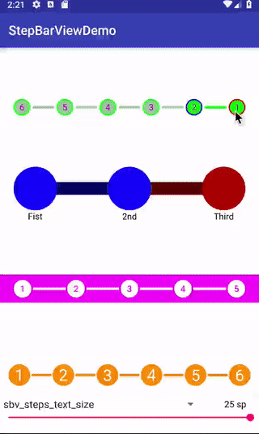

[](https://opensource.org/licenses/Apache-2.0)
[](https://github.com/imaNNeoFighT/StepBarView/raw/master/repo_files/SbvDemo1-0-5.apk)
[](https://jitpack.io/#imaNNeoFighT/StepBarView)
[](https://android-arsenal.com/details/1/6931)

# Step Bar View

You can use this library to have a step bar

can be used in pages that you have some steps to reach

you can download the [Demo apk file](https://github.com/imaNNeoFighT/StepBarView/raw/master/repo_files/SbvDemo1-0-5.apk) (you can first adjust your StepBar in the demoApp and then implement it in code)




## 1 - Getting Started

By this instructions you can add this library and i will explain how use it.


### Add Maven to your root build.gradle

First of all Add it in your root build.gradle at the end of repositories:

```
allprojects {
  repositories {
    ...
    maven { url 'https://jitpack.io' }
  }
}
```

### Add Dependency

Add the dependency to your app build.gradle file

```
dependencies
{
    implementation  'com.github.imaNNeoFighT:StepBarView:1.0.5'
    // Or in older versions : 
    // compile'com.github.imaNNeoFighT:StepBarView:1.0.5'
}
```

And then sync your gradle and take a tea.


## 2 - About The View
You can simply use this View like other Views in android,
just add ``StepBarView`` in your java code or xml.

## View Properties 

you can customize StepBarView, all of this attributes can change via xml or code (runtime)


|Attribute|Type|Kotlin|Description|
|:---:|:---:|:---:|:---:|
|sbv_max_count|Integer|`maxCount`|your steps count (max to reach), default value is `8`|
|sbv_steps_reached_colors|Color|`stepsReachedColor`|steps reached color (steps circle reached color)|
|sbv_steps_unreached_colors|Color|`stepsUnreachedColor`|steps unReached color (steps circle default color)|
|sbv_steps_line_reached_colors|Color|`stepsLineReachedColor`|steps line reached color|
|sbv_steps_line_unreached_colors|Color|`stepsLineUnreachedColor`|steps line uReached color|
|sbv_steps_line_height|Dimensions|`stepsLineHeight`|steps line height, default value is `4dp`|
|sbv_steps_size|Dimensions|`stepsSize`|steps circle size, default value is `16dp`|
|sbv_steps_text_color|Color|`stepsTextColor`|steps text color (number that drawn on steps circle)|
|sbv_steps_text_size|Dimensions|`stepsTextSize`|steps text size, default is `14sp`|
|sbv_steps_line_margin_left|Dimensions|`stepsLineMarginLeft`|steps line margin left (gap in left of lines), default value is `2dp`|
|sbv_steps_line_margin_right|Dimensions|`stepsLineMarginRight`|steps line margin right (gap in right of lines), default value is `2dp`|
|sbv_allow_touch_step_to|Integer|`allowTouchStepTo`|allow touch to reach step (for example if you set 3 you can touch to reach step to 3 and not more), default value is `8`|
|sbv_show_step_index|Boolean|`showStepIndex`|you can set this property false to prevent showing indexes (then just a solid circle will be drawn), default value is `true`|
|sbv_steps_stroke_size|Dimensions|`stepsStrokeSize`| Stroke Size of steps , default value is `2dp`|
|sbv_steps_stroke_reached_color|Color|`stepsStrokeReachedColor`| Stroke color of reached steps|
|sbv_steps_stroke_unreached_color|Color|`stepsStrokeUnReachedColor`| Stroke color of unReached steps|
|sbv_steps_stroke_current_color|Color|`stepsStrokeCurrentColor`| Stroke color of current steps|
|sbv_show_step_stroke|Boolean|`showStepStroke`| flag to showing the Stroke or not!, default is false|
|sbv_is_rtl|Boolean|`isRtl`| flag to showing steps in RTL (Right to left), default is false|
|sbv_show_step_name|Boolean|`showStepName`| flag to show title below the steps, default is false|


# License
```
Copyright 2018 Iman Khoshabi

Licensed under the Apache License, Version 2.0 (the "License");
you may not use this file except in compliance with the License.
You may obtain a copy of the License at

    http://www.apache.org/licenses/LICENSE-2.0

Unless required by applicable law or agreed to in writing, software
distributed under the License is distributed on an "AS IS" BASIS,
WITHOUT WARRANTIES OR CONDITIONS OF ANY KIND, either express or implied.
See the License for the specific language governing permissions and
limitations under the License.
```
